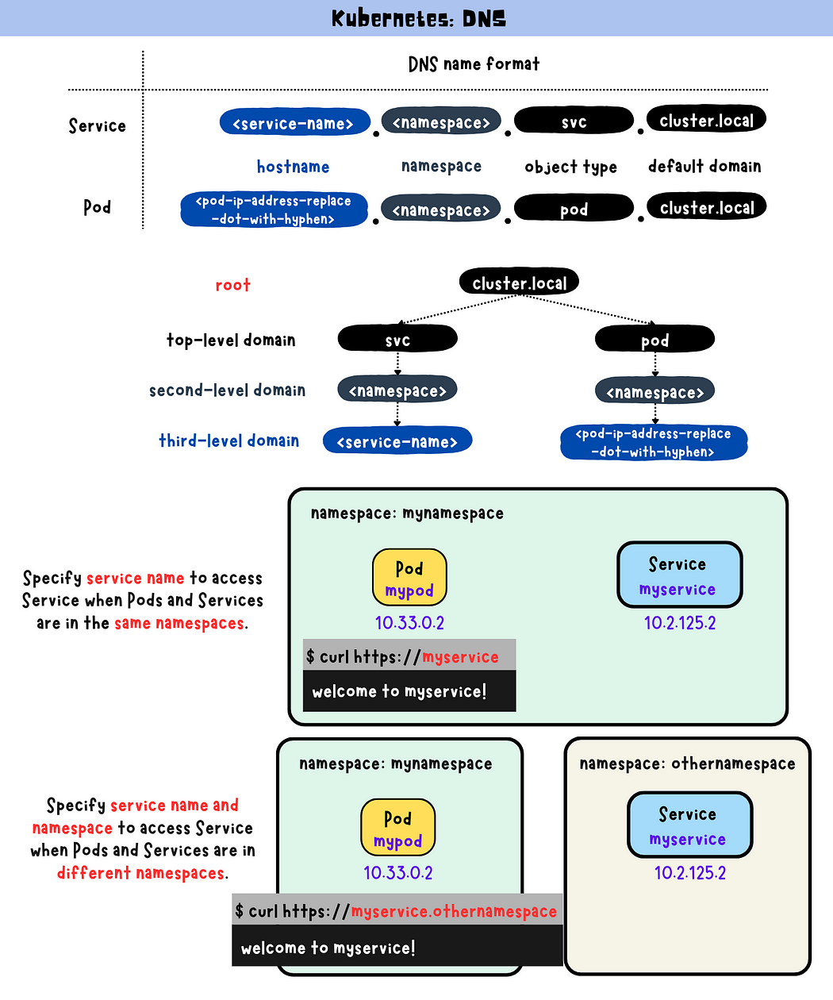

# Kubernetes DNS

In Kubernetes, DNS names are assigned to Pods and Services for communication by name instead of IP address. The default domain name used for DNS resolution within the cluster is cluster.local, which can be customized if required. The DNS name for a Service follows the format <service-name>.<namespace>.svc.cluster.local, while the DNS name for a Pod follows the format <pod-ip-address-replace-dot-with-hyphen>.<namespace>.pod.cluster.local. CoreDNS operates based on a configuration file called "Corefile" that specifies how the DNS server should operate and respond to incoming requests.

If you’re not familiar with DNS, you might find it helpful to check out this article on the basics of DNS: [Linux Networking: DNS.](./Linux%20Networking%20DNS.md)

## DNS Resolution
In Kubernetes, the DNS names assigned to Pods and Services are used for name resolution within the cluster, allowing Pods and Services to communicate with each other by name instead of IP address.
Default domain name: cluster.local
In Kubernetes, cluster.local is a default domain name used for DNS resolution within the cluster. The Kubernetes DNS service appends the namespace and cluster.local suffix to the name to form a fully qualified domain name (FQDN) when a DNS query is made for a Service or Pod within the same namespace. Although it is the default domain name, it can be customized to use a different domain name if required.
DNS name for Services
The DNS name for a Service in Kubernetes follows the below format:
`<service-name>.<namespace>.svc.cluster.local`
The the DNS name for a Pod in Kubernetes follows the below format:
`<pod-ip-address-replace-dot-with-hyphen>.<namespace>.pod.cluster.local`

## Pods and Services Interaction using DNS Names

### Pods and Services in the Same Namespace
When Pods and Services are in the same namespace, you can use the service name instead of the fully qualified domain name (FQDN) to access Services through queries.
### Pods and Services in different namespaces
When a Pod and a Service are in different namespaces in Kubernetes, you need to specify both the Service name and the namespace to access the Service from the Pod.

## CoreDNS
Before CoreDNS was introduced, Kubernetes used kube-dns as the default DNS solution. The DNS server handled DNS requests for Services and Pods in the cluster. Based on the official Kubernetes documentation, starting from version 1.11, CoreDNS is recommended as the default DNS solution and is installed by default with kubeadm.
Configuration file: Corefile
Corefile is a text file that specifies how the DNS server should operate and respond to incoming requests.
```
.:53 {
      errors
      health {
          lameduck 5s
      }
      ready
      kubernetes cluster.local in-addr.arpa ip6.arpa {
          pods insecure
          fallthrough in-addr.arpa ip6.arpa
          ttl 30
      }
      prometheus :9153
      forward . /etc/resolv.conf
      cache 30
      loop
      reload
      loadbalance
 }  

```
below is an example of edit the Corefile by adding a new record:

```
.:53 {
      errors
      health {
          lameduck 5s
      }
      ready
      kubernetes cluster.local in-addr.arpa ip6.arpa {
          pods insecure
          fallthrough in-addr.arpa ip6.arpa
          ttl 30
      }
      prometheus :9153
      forward . /etc/resolv.conf
      cache 30
      loop
      reload
      loadbalance
      172.16.
 }  
```

The top-level domain name for the cluster is specified as “cluster.local” in the Kubernetes plugin configuration. The plugin is also configured to handle reverse DNS lookups for IPv4 and IPv6 addresses using the in-addr.arpa and ip6.arpa domains.
To learn more about the Corefile and its syntax, please refer to the official documentation available at [CoreDNS Manual](https://coredns.io/manual/toc/) or [CoreDNS ConfigMap options](https://kubernetes.io/docs/tasks/administer-cluster/dns-custom-nameservers/#coredns-configmap-options)
