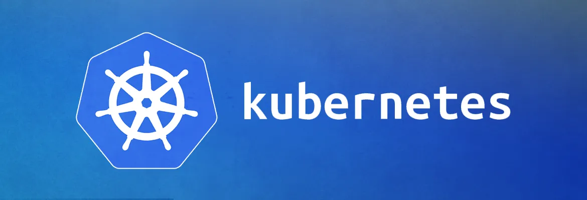

# Deployments

A Deployment provides declarative updates for Pods and ReplicaSets.

ReplicaSet have one major drawback: once you select the pods that are managed by a ReplicaSet, you cannot change their pod templates.
For example, if you are using a ReplicaSet to deploy four pods with NodeJS running and you want to change the NodeJS image to a newer version, you need to delete the ReplicaSet and recreate it. Restarting the pods causes downtime till the images are available and the pods are running again.
A Deployment resource uses a ReplicaSet to manage the pods. However, it handles updating them in a controlled way. Let’s dig deeper into Deployment Controllers and patterns.

Creating Your First Deployment
The following Deployment definition deploys four pods with nginx as their hosted application: