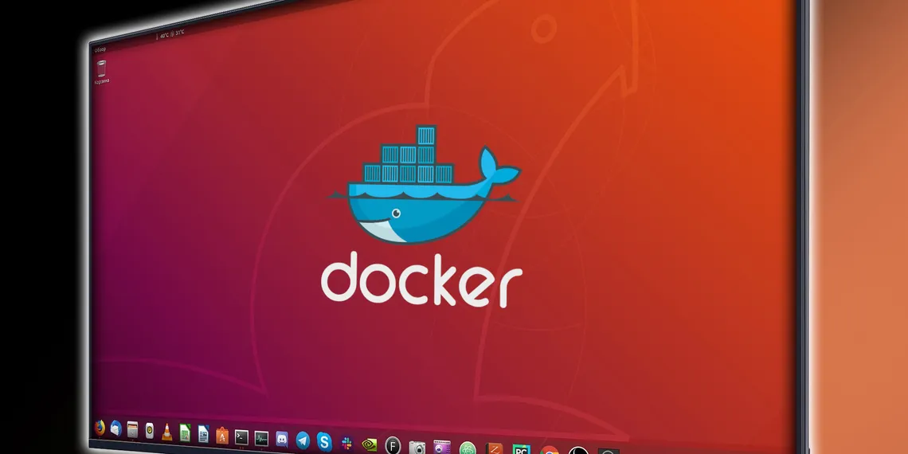

# Dockering run Ubuntu



## Step 1: Getting the Ubuntu Docker Image

```
docker pull ubuntu
```

## Step 2: Running the Ubuntu Image

```
docker run -ti --rm ubuntu /bin/bash
```

This command tells Docker to run the container in a terminal interactive mode (-ti). The /bin/bash argument is a way of telling the container to run the Bash shell terminal. Finally, the --rm flag instructs Docker to automatically remove the container after we stop it.

#### Saving the Docker Container State
When you stop the Docker container at this stage, you'll lose all the changes you made, including software updates and installed tools. That is how Docker containers are designed; they're easy to replace, stop, and manage.

To Save the state of the container by running the following command:

```
docker commit -a "Larry_Song" -m "MyUbuntu" 270011078e93 myubuntu:v1
```
The preceding command will pause the container before saving it and will create a new Docker image named myubuntu. The new Docker image will contain all changes that you've made to it. And with that, you've just created a custom Ubuntu Docker image.

### Persisting Data on the Ubuntu Docker Container
Another powerful feature of Docker is the ability to persist or share data with the host machine.

'''
docker volume create ubuntu_data

docker run -ti --rm -v C:\srdev\docker:/data myubuntu:v1 /bin/bash
'''

