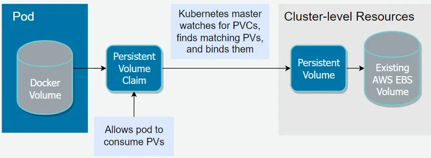

# Persistent Volumes

## Volumes

Docker has a concept of volumes (Docker has two options for containers to store files on the host machine - volumes, and bind mounts), Volumes are a mechanism for storing data outside containers. All volumes are managed by Docker and stored in a dedicated directory on your host, usually /var/lib/docker/volumes for Linux systems.

Volumes are mounted to filesystem paths in your containers. When containers write to a path beneath a volume mount point, the changes will be applied to the volume instead of the container’s writable image layer. The written data will still be available if the container stops – as the volume’s stored separately on your host, it can be remounted to another container or accessed directly using manual tools.


* Volumes are stored in a part of the host filesystem which is managed by Docker (/var/lib/docker/volumes/ on Linux). Non-Docker processes should not modify this part of the filesystem. Volumes are the best way to persist data in Docker.

* Bind mounts may be stored anywhere on the host system. They may even be important system files or directories. Non-Docker processes on the Docker host or a Docker container can modify them at any time.

* tmpfs mounts are stored in the host system’s memory only, and are never written to the host system’s filesystem.

Let's check this out by a demo:

```
# run postgres
docker run -d --rm -e POSTGRES_DB=postgresdb -e POSTGRES_USER=admin -e POSTGRES_PASSWORD=admin123 postgres:10.4

# enter the container
docker exec -it <contaner id> bash

# login to postgres
psql --username=admin postgresdb

#create a table
CREATE TABLE COMPANY(
   ID INT PRIMARY KEY     NOT NULL,
   NAME           TEXT    NOT NULL,
   AGE            INT     NOT NULL,
   ADDRESS        CHAR(50),
   SALARY         REAL
);

#show table
\dt

# quit 
\q
```
Restarting the above container and going back in you will notice \dt commands returning no tables. Since data is lost.
```
#exit container and rm container 
docker rm -f <contaner id>
```
### Persist data Docker
```
docker volume create postges

#docker run -v /path/on/host:/path/inside/container image -- Then all your data will persist in /path/on/host; 
docker run -d --rm -v postges:/var/lib/postgresql/data -e POSTGRES_DB=postgresdb -e POSTGRES_USER=admin -e POSTGRES_PASSWORD=admin123 postgres:10.4

# run the same tests as above and notice
```

## Kubernates Persistence Volume

Persistent volume (PV) is a piece of storage provided by an administrator in a Kubernetes cluster. When a developer needs persistent storage for an application in the cluster, they request that storage by creating a persistent volume claim (PVC) and then mounting the volume to a path in the pod. Once that is done, the pod claims any volume that matches its requirements (such as size, access mode, and so on). An administrator can create multiple PVs with different capacities and configurations. It is up to the developer to provide a PVC for storage, and then Kubernetes matches a suitable PV with the PVC. If there is no PV to match the PVC, the StorageClass dynamically creates a PV and binds it to the PVC.

It is important to note that Kubernetes does not restrict PVs to a namespace, which means that a pod in any namespace can claim a PV for storage.



Below is an example of a PersistentVolume YAML file used for creating persistent volume storage:

``` yml
apiVersion: v1
kind: PersistentVolume
metadata:
  name: persistent-volume
spec:
  capacity:
   storage: 10Gi
  accessModes:
   - ReadWriteOnce
  hostPath:
    path: "/mnt/data" ## the data that will be stored in host
  storageClassName: hostpath
```
### Storage Class

Provisioner of kubernetes Storage, help kubernets interface with storage 

[https://kubernetes.io/docs/concepts/storage/storage-classes/](https://kubernetes.io/docs/concepts/storage/storage-classes/)

### Persistence Volume Clain (PVC)

kubernetes send request for sotrage 
unlike PV, PVC is namespace bind

[https://kubernetes.io/docs/concepts/storage/persistent-volumes/#persistentvolumeclaims](https://kubernetes.io/docs/concepts/storage/persistent-volumes/#persistentvolumeclaims)

## Refrence 

[https://kubernetes.io/docs/concepts/storage/persistent-volumes/](https://kubernetes.io/docs/concepts/storage/persistent-volumes/)

[https://www.youtube.com/watch?v=ZxC6FwEc9WQ](https://www.youtube.com/watch?v=ZxC6FwEc9WQ)

[Docker Volume](https://spacelift.io/blog/docker-volumes)

[Docker Storage](https://docs.docker.com/storage/)

[git-kubernetes](https://github.com/marcel-dempers/docker-development-youtube-series)

[https://kamsjec.medium.com/kubernetes-persistent-volumes-and-persistent-volume-claim-5148338120e4](https://kamsjec.medium.com/kubernetes-persistent-volumes-and-persistent-volume-claim-5148338120e4)