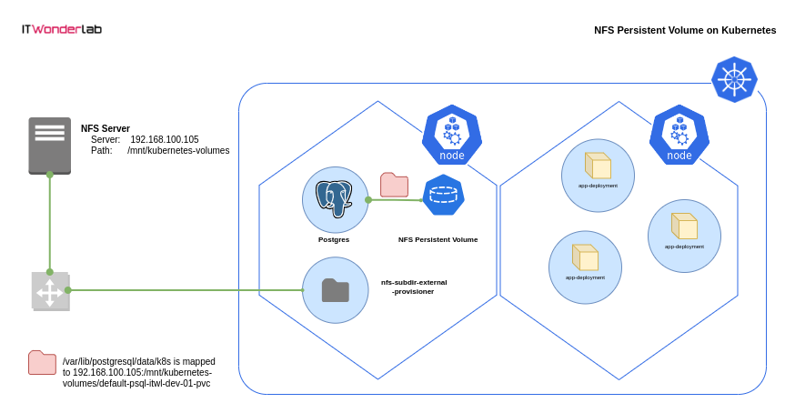

# How to use an external NFS Persistent Volume on Kubernetes



Pre-Condition: NFS Server is ready: (localhost:2049)

1. Install an external NFS provisioner in Kubernetes

Kubernetes doesn't include an internal NFS provisioner. You need to use an external provisioner to create a StorageClass for NFS.

Check Kubernetes available StorageClasses:

```
$ kubectl get storageclasses
NAME                   PROVISIONER             RECLAIMPOLICY   VOLUMEBINDINGMODE      ALLOWVOLUMEEXPANSION   AGE
local-path (default)   rancher.io/local-path   Delete          WaitForFirstConsumer   false                  18h
```
[nfs-subdir-external-provisioner](https://github.com/kubernetes-sigs/nfs-subdir-external-provisioner) will be configured and used to provide NFS storage to PersistentVolumeClaims.

```
helm repo add nfs-subdir-external-provisioner https://kubernetes-sigs.github.io/nfs-subdir-external-provisioner/
$ helm install nfs-subdir-external-provisioner nfs-subdir-external-provisioner/nfs-subdir-external-provisioner \
    --set nfs.server=192.168.100.105 \
    --set nfs.path=/mnt/kubernetes-volumes \
    --set storageClass.onDelete=retain \
    --set storageClass.pathPattern='/${.PVC.namespace}-${.PVC.name}' \
    --kubeconfig /etc/rancher/k3s/k3s.yaml 
```

or:

`helm install nfs-subdir-external-provisioner nfs-subdir-external-provisioner/nfs-subdir-external-provisioner --values .\nfs-subdir-external-provisioner-values.yaml`

2. Deploy Postgres on Kubernetes using an NFS Persistent Volumes

`kubectl create ns postgres`

`kubectl apply -f ./postfres.yaml -n postgres`

```
apiVersion: v1
kind: ConfigMap
metadata:
  name: psql-itwl-dev-01-cm
data:
  POSTGRES_DB: db
  POSTGRES_USER: user
  POSTGRES_PASSWORD: pass
  PGDATA: /var/lib/postgresql/data/k8s

---

apiVersion: v1
kind: PersistentVolumeClaim
metadata:
  name: psql-itwl-dev-01-pvc
spec:
  accessModes:
    - ReadWriteMany
  storageClassName: nfs-client
  resources:
    requests:
      storage: 1Gi
---

apiVersion: apps/v1
kind: StatefulSet
metadata:
  name: psql-itwl-dev-01
  labels: 
    app: psql 
    ver: itwl-dev-01
spec:
  replicas: 1
  selector:
    matchLabels: 
      app: psql
      ver: itwl-dev-01
  serviceName: "itwl-dev-01"
  template: #For the creation of the pod      
    metadata:
      labels:
        app: psql
        ver: itwl-dev-01
    spec:
      containers:
        - name: postgres
          image: postgres:latest
          imagePullPolicy: "IfNotPresent"
          ports:
            - containerPort: 5432 
          envFrom:
            - configMapRef:
                name: psql-itwl-dev-01-cm          
          volumeMounts:
            - mountPath: /var/lib/postgresql/data
              name: pgdatavol
      volumes:
        - name: pgdatavol
          persistentVolumeClaim:
            claimName: psql-itwl-dev-01-pvc
---

apiVersion: v1
kind: Service
metadata:
  name: postgres-service-lb
spec:
  type: LoadBalancer
  selector:
    app: psql
  ports:
    - name: psql
      port: 5432       
      targetPort: 5432
      nodePort: 30101   
      protocol: TCP      
```