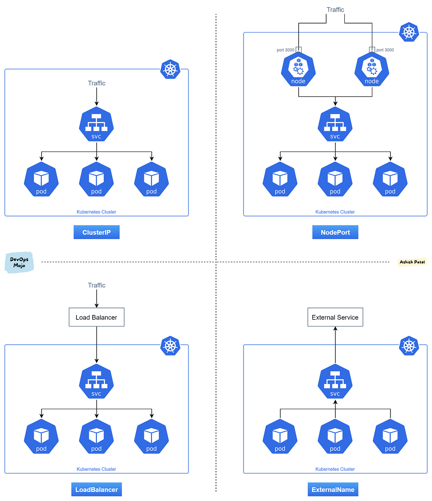

# Service resources 

An abstract way to expose an application running on a set of Pods as a network service.

Each Pod gets its own IP address, however in a Deployment, the set of Pods running in one moment in time could be different from the set of Pods running that application a moment later.

This leads to a problem: if some set of Pods (call them "backends") provides functionality to other Pods (call them "frontends") inside your cluster, how do the frontends find out and keep track of which IP address to connect to, so that the frontend can use the backend part of the workload?

Enter Services

## Defining a Service
A Service in Kubernetes is a REST object, similar to a Pod. Like all of the REST objects, you can POST a Service definition to the API server to create a new instance. The name of a Service object must be a valid [RFC 1035 label name](https://kubernetes.io/docs/concepts/overview/working-with-objects/names/#rfc-1035-label-names).

### Deploying a Kubernetes Service （default service type ClusterIP)

``` yml
apiVersion: v1
kind: Service
metadata:
  name: my-nginx
  namespace: k8s-demo
  labels:
    run: my-nginx
spec:
  type: ClusterIP
  ports:
  - port: 80
    protocol: TCP
    targetPort: 80
  selector:
    app: nginx

```
This specification will create a Service which targets TCP port 80 on any Pod with the run: my-nginx label, and expose it on an abstracted Service port (targetPort: is the port the container accepts traffic on, port: is the abstracted Service port, which can be any port other pods use to access the Service).

As mentioned previously, a Service is backed by a group of Pods. These Pods are exposed through endpoints. The Service’s selector will be evaluated continuously and the results will be POSTed to an Endpoints object also named my-nginx. When a Pod dies, it is automatically removed from the endpoints, and new Pods matching the Service’s selector will automatically get added to the endpoints. Check the endpoints, and note that the IPs are the same as the Pods created in the first step:
kubectl describe svc my-nginx

You should now be able to curl the nginx Service on : from any node in your cluster. Note that the Service IP is completely virtual, it never hits the wire. If you’re curious about how this works you can read more about the service proxy.

### Accessing the Service
Kubernetes supports 2 primary modes of finding a Service - environment variables and DNS
##### Environment Variables
When a Pod runs on a Node, the kubelet adds a set of environment variables for each active Service. This introduces an ordering problem. To see why, inspect the environment of your running nginx Pods (your Pod name will be different):
kubectl exec my-nginx-3800858182-jr4a2 -- printenv | grep SERVICE

KUBERNETES_SERVICE_HOST=10.0.0.1
KUBERNETES_SERVICE_PORT=443
KUBERNETES_SERVICE_PORT_HTTPS=443

Note there’s no mention of your Service. This is because you created the replicas before the Service. Another disadvantage of doing this is that the scheduler might put both Pods on the same machine, which will take your entire Service down if it dies. We can do this the right way by killing the 2 Pods and waiting for the Deployment to recreate them. This time around the Service exists before the replicas. This will give you scheduler-level Service spreading of your Pods (provided all your nodes have equal capacity), as well as the right environment variables:
kubectl scale deployment my-nginx --replicas=0; kubectl scale deployment my-nginx --replicas=2;

kubectl get pods -l run=my-nginx -o wide
NAME                        READY     STATUS    RESTARTS   AGE     IP            NODE
my-nginx-3800858182-e9ihh   1/1       Running   0          5s      10.244.2.7    kubernetes-minion-ljyd
my-nginx-3800858182-j4rm4   1/1       Running   0          5s      10.244.3.8    kubernetes-minion-905m

You may notice that the pods have different names, since they are killed and recreated.
kubectl exec my-nginx-3800858182-e9ihh -- printenv | grep SERVICE

KUBERNETES_SERVICE_PORT=443
MY_NGINX_SERVICE_HOST=10.0.162.149
KUBERNETES_SERVICE_HOST=10.0.0.1
MY_NGINX_SERVICE_PORT=80
KUBERNETES_SERVICE_PORT_HTTPS=443

### Service Type
There are four types of Kubernetes services — ClusterIP, NodePort, LoadBalancer and ExternalName. The type property in the Service's spec determines how the service is exposed to the network.



#### 1. ClusterIP
•	ClusterIP is the default and most common service type.
•	Kubernetes will assign a cluster-internal IP address to ClusterIP service. This makes the service only reachable within the cluster.
•	You cannot make requests to service (pods) from outside the cluster.
•	You can optionally set cluster IP in the service definition file.
Use Cases: 
•	Inter service communication within the cluster. For example, communication between the front-end and back-end components of your app.

As Long as kube-dns is running, all service objects (including ClusterIP services) have an in cluster dns name: service_name + "." + service_namespace + ".svc.cluster.local", so all other things would address your backened service as http://service_name + "." + service_namespace + ".svc.cluster.local"

#### 2. NodePort
•	NodePort service is an extension of ClusterIP service. A ClusterIP Service, to which the NodePort Service routes, is automatically created.
•	It exposes the service outside of the cluster by adding a cluster-wide port on top of ClusterIP.
•	NodePort exposes the service on each Node’s IP at a static port (the NodePort). Each node proxies that port into your Service. So, external traffic has access to fixed port on each Node. It means any request to your cluster on that port gets forwarded to the service.
•	You can contact the NodePort Service, from outside the cluster, by requesting <NodeIP>:<NodePort>.
•	Node port must be in the range of 30000–32767. Manually allocating a port to the service is optional. If it is undefined, Kubernetes will automatically assign one.
•	If you are going to choose node port explicitly, ensure that the port was not already used by another service.
Use Cases: 
•	When you want to enable external connectivity to your service.
•	Using a NodePort gives you the freedom to set up your own load balancing solution, to configure environments that are not fully supported by Kubernetes, or even to expose one or more nodes’ IPs directly.
•	Prefer to place a load balancer above your nodes to avoid node failure.

### 3. LoadBalancer
•	LoadBalancer service is an extension of NodePort service. NodePort and ClusterIP Services, to which the external load balancer routes, are automatically created.
•	It integrates NodePort with cloud-based load balancers.
•	It exposes the Service externally using a cloud provider’s load balancer.
•	Each cloud provider (AWS, Azure, GCP, etc) has its own native load balancer implementation. The cloud provider will create a load balancer, which then automatically routes requests to your Kubernetes Service.
•	Traffic from the external load balancer is directed at the backend Pods. The cloud provider decides how it is load balanced.
•	The actual creation of the load balancer happens asynchronously.
•	Every time you want to expose a service to the outside world, you have to create a new LoadBalancer and get an IP address.
Use Cases
•	When you are using a cloud provider to host your Kubernetes cluster.

### 4. ExternalName
•	Services of type ExternalName map a Service to a DNS name, not to a typical selector such as my-service.
•	You specify these Services with the `spec.externalName` parameter.
•	It maps the Service to the contents of the externalName field (e.g. foo.bar.example.com), by returning a CNAME record with its value.
•	No proxying of any kind is established.
Use Cases：
•	This is commonly used to create a service within Kubernetes to represent an external datastore like a database that runs externally to Kubernetes.
•	You can use that ExternalName service (as a local service) when Pods from one namespace to talk to a service in another namespace.

### Ingress
You can also use Ingress to expose your Service. Ingress is not a Service type, but it acts as the entry point for your cluster. It lets you consolidate your routing rules into a single resource as it can expose multiple services under the same IP address.

For more about ingerss, please reger to [ingress](../ingress_nginx/Kubernetes%20Ingress%20Tutorial%20for%20Beginners.md)


#### DNS
Kubernetes offers a DNS cluster addon Service that automatically assigns dns names to other Services. You can check if it’s running on your cluster:
kubectl get services kube-dns --namespace=kube-system

For more details for kubernetes DNS, Please refer to [kubernetes DNS](../DNS/Kubernetes%20DNS.md)


