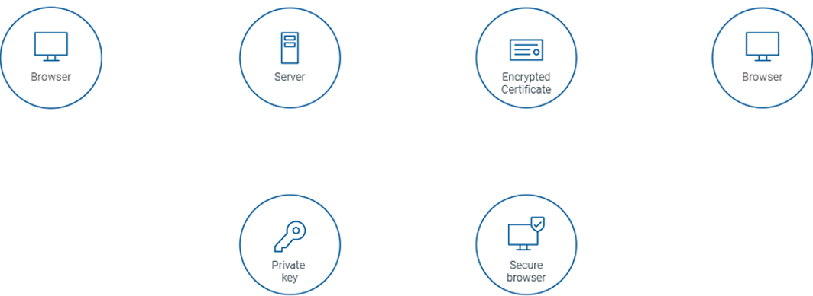
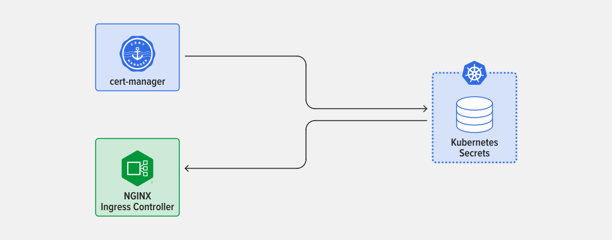
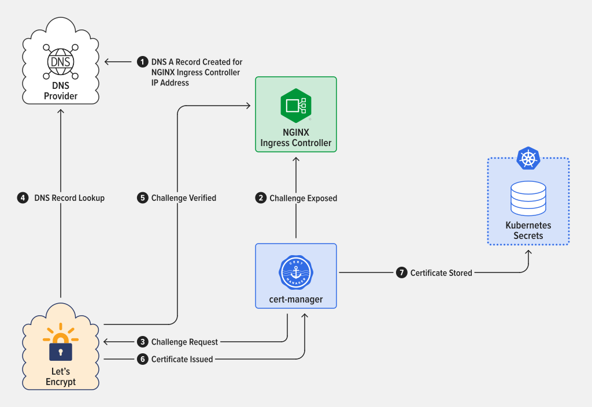
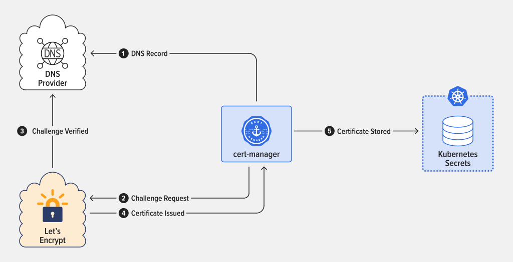

# SSL/TLS for your Kubernetes Cluster with Cert-Manager

## How TLS/SSL Certificates Work
Transport Layer Security (TLS) certificates, also known as Secure Sockets Layer (SSL), are essential to securing internet browser connections and transactions through data encryption. TLS/SSL is the standard security technology that works behind the scenes to keep your online transactions and logins secure—here’s how it works.

Invisible to the end-user, a process called the “TLS/SSL handshake” creates a protected connection between your web server and web browser nearly instantaneously every time you visit a website. Websites secured by a TLS/SSL certificate will display HTTPS and the small padlock icon in the browser address bar. TLS/SSL certificates are used to protect both the end users’ information while it’s in transfer, and to authenticate the website’s organization identity to ensure users are interacting with legitimate website owners.

### THE TLS/SSL HANDSHAKE PROCESS

1. Each TLS certificate consists of a key pair made of a public key and private key.
These keys are important because they interact behind the scenes during website transactions.

2. Every time you visit a website, the client server and web browser communicate to ensure there is a secure TLS/SSL encrypted connection.

3. When a web browser (or client) directs to a secured website, the website server shares its TLS/SSL certificate and its public key with the client to establish a secure connection and a unique session key.

4. The browser confirms that it recognizes and trusts the issuer, or Certificate Authority, of the SSL certificate—in this case DigiCert. The browser also checks to ensure the TLS/SSL certificate is unexpired, unrevoked, and that it can be trusted.

5. The browser sends back a symmetric session key and the server decrypts the symmetric session key using its private key. The server then sends back an acknowledgement encrypted with the session key to start the encrypted session.

6. Server and browser now encrypt all transmitted data with the session key. They begin a secure session that protects message privacy, message integrity, and server security.

## Certificates in Kubernetes Environment
The term “TLS certificate” refers to two components required to enable HTTPS connections on our Ingress controller:
* The certificate
* The private key
In Kubernetes, these two components are stored as Secrets. Kubernetes workloads – such as the NGINX Ingress Controller and cert-manager – can write and read these Secrets, which can also be managed by users who have access to the Kubernetes installation.

## Introducing cert-manager
The cert-manager project is a certificate controller that works with Kubernetes and OpenShift. When deployed in Kubernetes, cert-manager will automatically issue certificates required by Ingress controllers and will ensure they are valid and up-to-date. Additionally, it will track expiration dates for certificates and attempt renewal at a configured time interval. 

### Two Challenge Types
When using Let’s Encrypt, all cert management is handled automatically. While this provides a great deal of convenience, it also presents a problem: How does the service ensure that you own the fully-qualified domain name (FQDN) in question?

This problem is solved using a challenge, which requires you to answer a verification request that only someone with access to the specific domain’s DNS records can provide. Challenges take one of two forms:

1. HTTP-01: This challenge can be answered by having a DNS record for the FQDN that you are issuing a certificate. For example, if your server is at IP www.xxx.yyy.zzz and your FQDN is cert.example.com, the challenge mechanism will expose a token on the server at www.xxx.yyy.zzz and the Let’s Encrypt servers will attempt to reach it via cert.example.com. If successful, the challenge is passed and the certificate is issued.
 

HTTP-01 is the simplest way to generate a certificate, as it does not require direct access to the DNS provider. This type of challenge is always conducted over Port 80 (HTTP). Note that when using HTTP-01 challenges, cert-manager will utilize the Ingress controller to serve the challenge token.


2. DNS-01: This challenge creates a DNS TXT record with a token, which is then verified by the issuer. If the token is recognized, you have proved ownership of that domain and can now issue certificates for its records. Unlike the HTTP-01 challenge, when using the DNS-01 challenge, the FQDN does not need to resolve to your server’s IP address (nor even exist). Additionally, DNS-01 can be used when Port 80 is blocked. The offset to this ease of use is the necessity of providing access to your DNS infrastructure via API token to the cert-manager installation.


## Installing Cert-Manager

```
 helm repo add jetstack https://charts.jetstack.io
helm repo update
helm install cert-manager jetstack/cert-manage --namespace cert-manager --create-namespace --version v1.9.1  --set installCRDs=true 
```


## Reference
[https://www.nginx.com/blog/automating-certificate-management-in-a-kubernetes-environment/](https://www.nginx.com/blog/automating-certificate-management-in-a-kubernetes-environment/)
