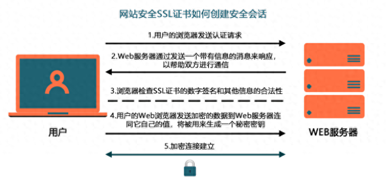
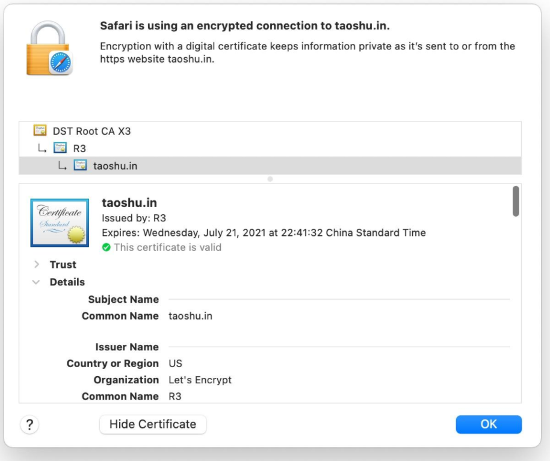
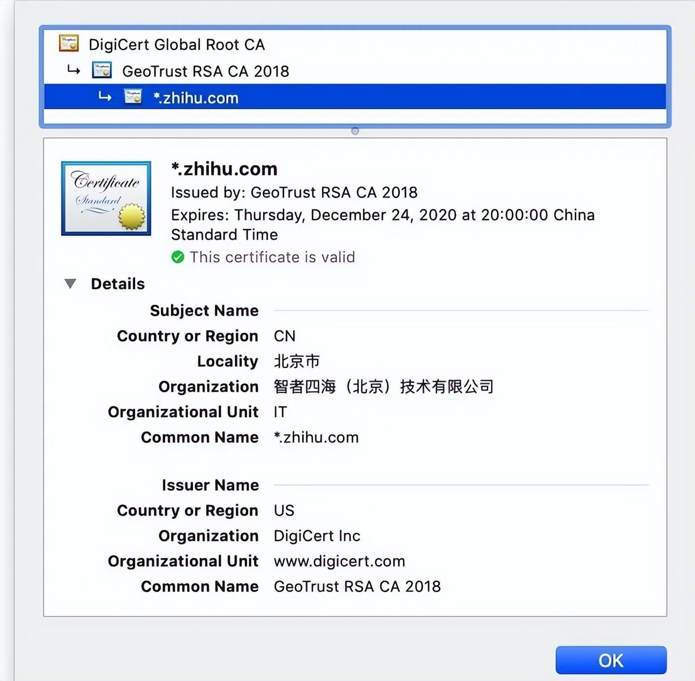

# SSL证书

## 加密的基本原理
SSL 证书是用来加密 HTTP 请求的

* 对称加密
对称加密算法使用相同的密钥进行加密和解密，它的计算量小，速度快，是最常用的加密方式，也是密码学和各种安全技术应用的基础

* 非对称加密
所谓非对称加密，就是利用数学方法生成一对密钥，一个对外公开，所有人都能看，我们称之为公钥;另一个自己妥善保存，不可轻易示人，我们称之为私钥。如果一方要通信，可以使用对方的公钥对数据进行加密，对方再用自己在私钥解密。这里跟对称加密最大的不同就是要用到公、私两个密钥。因为私钥不需要发给别人，所以非常安全。

那我们可以直接使用非对称加密技术来加密HTTP通信吗?并不能!因为非对称加密虽然安全，但计算量很大，加密和解密过程都比较慢。对称加密倒是快，但不安全。于是人们就把这两种加密方法结合起来，形成了现在通行的 SSL 或者 TLS 加密体系。其核心是在通信之前随机生成一份密码本，然后用非对称加密之后发给对方。这样双方就有同一份密码，然后可以用对称加密进行通信。每次都可以生成新的密码，用完就扔，保证安全性。

以上就是 SSL/TLS 加密通信的大致原理。但是 SSL 证书在这个过程有起到什么作用吗
SSL 证书对 HTTPS 的加密过程来说，没有任何作用!那为什么还要申请证书呢?这就需要讲另一个问题--公钥验证.

大家可以把 SSL 证书想象成公证处开的证明，证明某个公钥是某网站的公钥。这里的公证处就是所谓的 CA 机构。我们可以按一定的格式，把自己的公钥(不是私钥，私钥一辈子都不能给别人!)、网站域名，甚至是组织信息填写到一个文件中发给CA，CA会用自己的私钥对这个文件进行签名，而这个签名可以根据CA的公钥来验证。所以说，CA也有一对私钥和公钥。那问题又来了，会不会有人冒充CA来发布伪造的公钥呢?确实会。这个问题是由操作系统厂商来解决的。不论是 windows、linux、android 还是 macos、ios，都会内置一份 CA 公钥列表(也叫CA根证书)，只有系统内置的CA签发的证书才是有效证书!
SSL证书就是一份证明，证明某公钥确实是某网站的公钥。这里面需要用到 CA 这个中间机构。那为什么 SSL 证书需要钱呢?那是因为 CA 机构在签发证书之前需要对公钥跟网站和组织的关系进行验证，这个过程有成本，另外就是CA机构需要应对WebTrust 等机构的审计，也需要支付不小的费用。所以说，传统的 SSL 证书比较贵。

CA 会验证什么

根据验证信息范围的不同，SSL证书 有DV、OV和EV三种认证级别。

DV 证书
第一级叫 DV，全称 Domain validated，也就是域名认证。此证书可以证明网站所有人具有对应域名的所有权，证书信息里面只有域名一项(Common Name 字段)，比如下面就是 Let'sEncrypt 签发的一张 DV 证书。

通过 DV 证书，使用者唯一可以确定的是这枚公钥是某个DNS域名的公钥。因为证书上只有域名这一项信息。

OV 证书
第二级叫 OV，全称 Organization validated，也就是组织认证。证书里除了注明了域名之外还添加了公司名(Organization)等信息。我们平时见到的 https 网站多用这种级别的证书。下图就是知乎的证书信息。

EV证书
第三级叫EV，全称Extended validation，也就是扩展型验证。CA 会对证书持有人进行更加全面的认证。如果浏览器会在网址左边显示组织机构信息。用户看到这些信息会更加放心。但现在常用的浏览器已经不再展示了。所以EV证书的相当大的一个优势也就没有了，除了安全等级更高外，与OV证书区别已经不太大了，考虑性价比，有相当一部分之前使用EV证书用户换用OV证书了。

最后回归到问题的本质，付费证书和免费证书有本质上的区别吗？

其实区别还是比较大的，不知道各位有没有发现，目前市面上所有的免费证书基本都是DV证书，其中有且以DV单域名证书居多。DV多域名和证书和DV通配符证书基本很少见。这一点就能大概了解免费证书提供的安全系数相对来说还是有限的，不过这也同样需要看所用的具体环境吧。

对于一些个人门户网站或者是小微企业来说，网站只是用于展示形象或者展示基本信息的话使用免费证书是完全没有问题的（自签名证书不推荐），如果还是觉得不够安全的话也可以花一些预算去购买付费证书，毕竟付费证书一般都带承保，即使出现经济损失也可以及时理赔。而免费证书是不可能出现承保这一说法的，毕竟人家都给你免费用了。

那么对于一些中、大型企业来说，付费证书则是标配了，一般中大型企业或是电商企业网站中会含有相当一部分的企业机密或是客户信息，诸如此类信息一旦发生泄漏则会造成非常巨大的影响，使用安全级别相对较高的证书自然也是理所应当。

总而言之、言而总之使用免费证书和付费证书与否取决于个人需求，个人门户和小微企业建议使用免费证书（有预算的话也可以用付费证书、毕竟现在证书也不贵），中型、大型企业、电商企业强烈推荐使用付费证书。

免费证书这块大家可能了解的比较多的就是Let's Encrypt了，提供免费DV单域名证书，唯一美中不足的地方可能就是R3证书的兼容性一直以来都有些不尽如人意。

还有JoySSL证书，基于全球可信四大根，纯中文网站，网盾公司旗下证书。目前在国内也是政务部门和高校的首选免费证书，提供免费不限量一年期证书、和免费多域名证书、免费通配符证书。可以先向JoySSL官网工作人员发送自己需要保护的域名，提交自己所需要的证书类型，注册时填写230912即可免费使用。

永久免费SSL证书_永久免费https证书_永久免费ssl证书申请-JoySSL

可以用于单域名、多域名、通配符皆可免费使用。

配合操作域名解析申请，不会操作的话也会有工作人员协助安装部署。

安装好证书后即可实现https