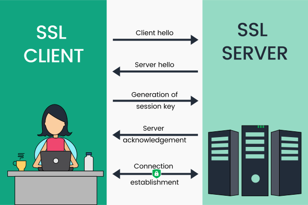

# What is an SSL certificate – Definition and Explanation

## What is an SSL certificate?
An SSL certificate is a digital certificate that authenticates a website's identity and enables an encrypted connection. SSL stands for Secure Sockets Layer, a security protocol that creates an encrypted link between a web server and a web browser.

Companies and organizations need to add SSL certificates to their websites to secure online transactions and keep customer information private and secure.

In short: SSL keeps internet connections secure and prevents criminals from reading or modifying information transferred between two systems. When you see a padlock icon next to the URL in the address bar, that means SSL protects the website you are visiting.

## How do SSL certificates work?
SSL works by ensuring that any data transferred between users and websites, or between two systems, remains impossible to read. It uses encryption algorithms to scramble data in transit, which prevents hackers from reading it as it is sent over the connection. This data includes potentially sensitive information such as names, addresses, credit card numbers, or other financial details.

The process works like this:

1. Client hello - The client sends the server a request to establish a connection, including a list of its compatible cipher suites and SSL/TLS versions.
2. Server hello - The server receives the request, checks the cipher suites and SSL versions, and chooses a mutually compatible cipher suite and SSL version from the list. The server also sends its certificate along with the public key.
3. Generation of pre-master key - The client receives the certificate, extracts the public key, and creates a new key called the "pre-master key" and sends it to the server.
4. Decryption of the pre-master key - The server decrypts the pre-master key using its private key.
5. Generation of the shared secret - Both the server and client now use the pre-master key and compute a shared secret called the session key (symmetrical encryption key).
6. Client verification - The client sends a test message that’s encrypted with the session key to the server.
7. Server acknowledgement - The server receives the message, decrypts it using the session key, and sends an acknowledgement that’s also encrypted using the session key back to the client, requesting to initiate the session.
8. Connection establishment - The session begins and both the client and server use the session key to encrypt their communication during the rest of the session.

To view an SSL certificate's details, you can click on the padlock symbol located within the browser bar. Details typically included within SSL certificates include:

* The domain name that the certificate was issued for
* Which person, organization, or device it was issued to
* Which Certificate Authority issued it
* The Certificate Authority's digital signature
* Associated subdomains
* Issue date of the certificate
* The expiry date of the certificate
* The public key (the private key is not revealed)

## Why Do I Need an SSL Certificate

SSL Certificates protect your sensitive information such as credit card information, usernames, passwords etc. They also:

* Keep data secure between servers
* ncrease your Google Rankings
* Build/Enhance customer trust
* Improve conversion rates

## Where Do I Buy an SSL Certificate?
SSL certificates can be obtained directly from a Certificate Authority (CA). Certificate Authorities – sometimes also referred to as Certification Authorities – issue millions of SSL certificates each year. They play a critical role in how the internet operates and how transparent, trusted interactions can occur online.

The cost of an SSL certificate can range from free to hundreds of dollars, depending on the level of security you require. Once you decide on the type of certificate you require, you can then look for Certificate Issuers, which offer SSLs at the level you require.

Obtaining your SSL involves the following steps:

Prepare by getting your server set up and ensuring your WHOIS record is updated and matches what you are submitting to the Certificate Authority (it needs to show the correct company name and address, etc.)
Generating a Certificate Signing Request (CSR) on your server. This is an action your hosting company can assist with.
Submitting this to the Certificate Authority to validate your domain and company details
Installing the certificate they provide once the process is complete.
Once obtained, you need to configure the certificate on your web host or on your own servers if you host the website yourself.

## Choose the right certificate type
To begin, you should research what type of certificate will fit your web application. Here are some important criteria you'll have to consider:

Level of trust: Commercial CAs offer three types of certificates, each involving a different level of vetting of your organization:

### Domain-validated (DV) certificates

This type of certificate secures and encrypts a particular domain name by validating the legitimacy of the domain owner.

### Organization-validated (OV) certificates

This type of certificate is generated after trusted CAs vet the organization requesting the certificate, so it provides a greater level of brand credibility for end users than a domain-validated certificate does.

### Extended-validation (EV) certificates

This type of certificate provides the highest level of security, and involves rigorous vetting of the organization requesting the certificate. The vetting is done as per the rules laid down by the CA/Browser Forum. Having an EV SSL on your website activates the address bar and displays your organization’s name in the browser's omnibox. EV certificates are generally used by major online retailers and banks as well as organizations that intend to build immediate trust with their end users.

## What are the differences between .pem, .cer and .der
.pem, .cer and .der are all file extensions for files that may contain a X.509 v3 certificate.

[What are the differences between .pem, .cer and .der?](https://stackoverflow.com/questions/22743415/what-are-the-differences-between-pem-cer-and-der/22743616)

[Does .pem file contain both private and public keys?](https://stackoverflow.com/questions/7539625/does-pem-file-contain-both-private-and-public-keys)

# Refernce
[https://www.kaspersky.com/resource-center/definitions/what-is-a-ssl-certificate](https://www.kaspersky.com/resource-center/definitions/what-is-a-ssl-certificate)

[Certificate Decoder](https://www.sslshopper.com/certificate-decoder.html)

[https://www.globalsign.com/en/ssl-information-center/what-is-an-ssl-certificate](https://www.globalsign.com/en/ssl-information-center/what-is-an-ssl-certificate)

[What is an SSL certificate](https://www.manageengine.com/key-manager/information-center/what-is-ssl-certificate.html)
