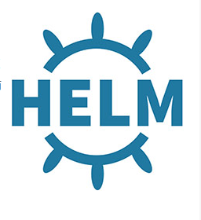

# Helm Chart Tutorial: A Complete Guide

Helm uses “charts” to package all the necessary resources and configurations of the application. A Helm chart is like a blueprint for deploying any application on Kubernetes. 

It contains all the Kubernetes resource YAML manifest files that are needed to run our application and some helm-related files organized in a specific directory structure. It uses a templating system based on the Go template to render Kubernetes manifests from charts.
## Helm Installation
1. Download the version you want to install from [here](https://github.com/helm/helm/releases).
2. Untar it running the command: tar -zxvf helm-v3.0.0-linux-amd64.tar.gz
3. Now find the helm binary in the unpacked directory, and move it to its desired destination.
4. mv <helm-binary-path> <local-bin-path>

Example: mv linux-amd64/helm /usr/local/bin/helm
Now run the below command to check the version: helm version

## Helm Architecture

Helm Client: The Helm CLI is a command-line interface built on Kubernetes’ client-go library.

Helm Library: The Helm library is a core engine that is used by clients to interact with the Kubernetes API server to install, upgrade, or roll back charts and to perform other Helm operations.

Helm Chart Structure:

`helm create test-chart`

Here we created a chart named test-chart. A directory called test-chart will automatically get created and can be checked by running the ls command. Now you can go through the directory and check the files inside it.
 tree test-chart/ 
test-chart/
├── Chart.yaml
├── charts
├── templates
│   ├── NOTES.txt
│   ├── _helpers.tpl
│   ├── deployment.yaml
│   ├── hpa.yaml
│   ├── ingress.yaml
│   ├── service.yaml
│   ├── serviceaccount.yaml
│   └── tests
│       └── test-connection.yaml
└── values.yaml

4 directories, 10 files

Let’s look at each file and directory inside a helm chart and understand its importance.

1. .helmignore: It’s a hidden file that’s why we’re not able to see it in the chart structure. Run the ls -a command from inside the directory to check it out. It is used to define all the files that we don’t want to include in the helm chart. 
2. Chart.yaml: It contains the basic information about the chart.
3. charts: It’s an empty directory. We can add any chart’s structure here on which our main chart depends.
4. templates: It’s a directory that contains all the Kubernetes manifest files that build an application. By default, helm created deployment.yaml, service.yaml, hpa.yaml, ingress.yaml, serviceaccount.yaml manifest files. We can modify and override these files as per our needs. We can even add other Kubernetes object’s manifest files. These manifest files can be templated to access values from values.yaml file. 
5. templates/NOTES.txt: This is a plaintext file that gets printed out after the chart is successfully deployed. 
6. templates/_helpers.tpl: That file contains several methods and sub-template. It helps keep our charts organized and avoids repeating the same code in multiple places.
7. templates/tests/: We can define tests here in our charts to validate that our chart works as expected when it is installed.
8. values.yaml: This file contains the values for the manifest files in the templates directory. For example, image name, replica count, HPA values, etc. We can create different values.yaml files based on the environments and change the values.

### Chart.yaml
As we know, we mention all the information related to the chart in this file such as the name and type of the chart, some description of the chart, versions, and all.
```yml
apiVersion: v2

name: test-chart

description: Test Helm Chart For Tutorial

type: application

version: 0.1.0

appVersion: "1.0.0"
```
1. apiVersion: It refers to the chart API version. v2 is the current apiVersion for the Helm 3 version.
   name: This field refers to the name of the chart.
2. description: A one-liner detail about the helm chart.
3. Type: There are 2 chart-type options: application and library. Type application refers to the charts that we deploy on Kubernetes. Type library refers to the charts that are reusable and can be used with other charts. 
4. Version: It refers to the version of our chart.
5. appVersion: It describes the version number of our application.

### templates
templates folder, which contains templated Kubernetes manifest files of some common resources. But, we may need some other resources in our application, which we’ll have to create as templates. We can also remove the resources which we don’t need.

deployment.yaml
```

 apiVersion: apps/v1 
 kind:  Deployment
 metadata: 
 name: {{ include "test-chart.fullname" . }}
 labels:
   {{- include "test-chart.labels" . | nindent 4 }}
spec:
 replicas: {{ .Values.replicaCount }}
 selector:
   matchLabels:
     {{- include "test-chart.selectorLabels" . | nindent 6 }}
 template:
   metadata:
     {{- with .Values.podAnnotations }}
     annotations:
       {{- toYaml . | nindent 8 }}
     {{- end }}
     labels:
       {{- include "test-chart.selectorLabels" . | nindent 8 }}
   spec:
     containers:
       - name: {{ .Chart.Name }}
         image: "{{ .Values.image.repository }}:{{ .Values.image.tag | default .Chart.AppVersion }}"
         imagePullPolicy: {{ .Values.image.pullPolicy }}
         ports:
           - name: http
             containerPort: 80
             protocol: TCP

```
Service.yaml

```

 apiVersion: v1 
kind:  Service
metadata: 
 name: {{ include "test-chart.fullname" . }}
 labels:
   {{- include "test-chart.labels" . | nindent 4 }}
spec:
 type: {{ .Values.service.type }}
 ports:
   - port: {{ .Values.service.port }}
     targetPort: {{ .Values.service.targetPort }}
     protocol: TCP
     name: {{ .Values.service.name }}
 selector:
   {{- include "test-chart.selectorLabels" . | nindent 4 }}

```

{{ .Object.Parameter }}
There are different [objects](https://helm.sh/docs/chart_template_guide/builtin_objects/) we can use. In our templates, we’re using Chart and Values. We mention the Chart object for using the parameters defined in the Chart.yaml and the Values object for values.yaml.

For example, in deployment.yaml file:
For the snippet {{ .Values.replicaCount }}, Helm will check the values.yaml file, find the replicaCount parameter, take the value of it, and render in deployment.yaml file. Similarly for snippet {{ .Chart.Name }}, it will check the Chart.yaml file, find the Name parameter, and get the value of it.

We can also see a snippet {{ include “test-chart.fullname” . }}, here we used the include keyword. Using it we ask Helm to check the _helpers.tpl file where some default templates are defined and get the value from there. So it will check for test-chart.fullname and get the value as per the definition there.

### Values.yaml
The values.yaml file is a configuration file used to set default values for various parameters. All the values in this file get substituted in the template directives we used in the templates.

The file is structured as key-value pairs, where the key notates the Kubernetes object’s field. Let’s replace the default values.yaml content with the following
```

 replicaCount:  2
 image: 
 repository: nginx
 tag: "1.25.3"
 pullPolicy: Always

service: 
 name: nginx-service
 type: ClusterIP
 port: 80
 targetPort: 8080

```
Here, we’re using only one values.yaml file, for example. We can have several values files based on environments.

Suppose we have 4 environments in our project: dev, qa, uat, prod. We can name these as values-dev.yaml, values-qa.yaml, values-uat.yaml and values-prod.yaml. 

Now, using these different files, we can customize our values as per the environment’s needs. For example, We may need more pod replicas in uat and prod environments so we can change the value of replicaCount in the respected files. 

At installation time, we can pass the file name in the command. The object’s template will then take the values accordingly and get deployed in the cluster.

### Validate the Helm Chart
To validate our helm charts before the actual deployment, helm provides multiple commands. Using these commands, we can check that all the things are in-place and correct.

1. helm lint: 
This command runs a series of tests to verify that the chart is valid and all the indentations are fine. It will throw the errors in case of any issues in the charts.

2. helm template: 
This command checks that the values are getting substituted in the templates. It will generate and display all the manifest files with the substituted values.

`helm template test-chart`

3. helm install — dry-run:
This command dry-runs the installation of the manifests and checks that all the templates are working fine. In case of any issues, it will throw the errors. If everything is good, then you will see the manifest output that would get deployed into the cluster.

helm install --dry-run <release-name> <chart-name>

## Deploy the Helm Chart
To deploy a helm chart, we use the helm install command.
`helm install `

`helm install nginx test-chart/ -f test-chart/values.yaml`  

## Upgrade the Helm Chart
To modify the chart and install the updated version, we can use the helm upgrade command.

 helm upgrade   

 ## Rollback the Helm Chart

 ## Uninstall the Helm Chart
 `helm uninstall metallb -n metallb-system`

 ## Package the Helm Chart

 ## Top 8 Helm Charts Best Practices
* Break down your charts into smaller, reusable modules for easier management and increased flexibility.
* Always version your Helm charts to track changes, enable easy rollbacks, and maintain a clear release history.
* We should increment the version and appVersion each time we make changes to the application.
* Use lowercase for the chart name and field name in values.yaml file.
* Always provide clear and concise documentation within your charts to ensure maintainable Helm charts.
* Name the Kubernetes manifest files after the Kind of object i.e. deployment.yaml, service.yaml, etc.
* Use Helm linting tools to catch issues early.
* Use the Helm community to leverage existing charts.   


