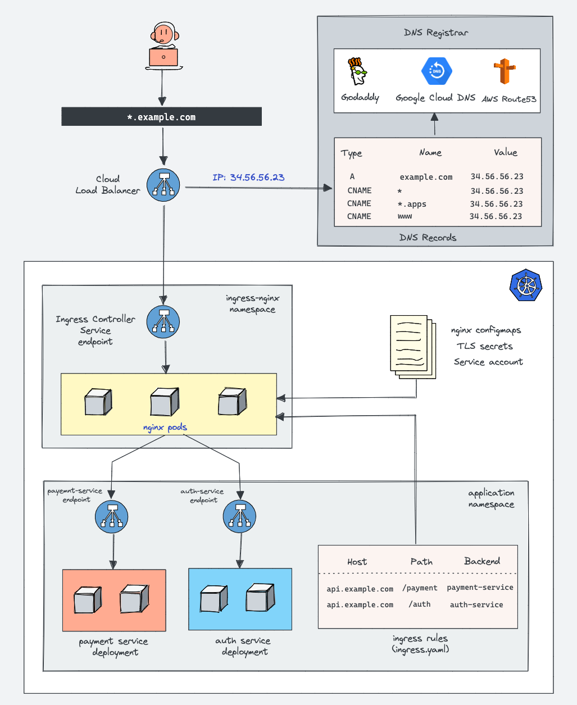

# Kubernetes Ingress Tutorial For Beginners
[https://devopscube.com/kubernetes-ingress-tutorial/](https://devopscube.com/kubernetes-ingress-tutorial/)


## What is Kubernetes Ingress?
Ingress is a native Kubernetes resource like pods, deployments, etc. Using ingress, you can maintain the DNS routing configurations. The ingress controller does the actual routing by reading the routing rules from ingress objects stored in etcd.

Without Kubernetes ingress, to expose an application to the outside world, you will add a service Type Loadbalancer to the deployments. Here is how it looks. (I have shown the nodePort just to show the traffic flow)


In the same implementation, with ingress, there is a reverse proxy layer (Ingress controller implementation) between the load balancer and the kubernetes service endpoint.


## How Does Kubernetes Ingress work?
You need to be very clear about two key concepts to understand How ingress works:

1. Kubernetes Ingress Resource: Kubernetes ingress resource is responsible for storing DNS routing rules in the cluster.
2. Kubernetes Ingress Controller: Kubernetes ingress controllers (Nginx/HAProxy etc.) are responsible for routing by accessing the DNS rules applied through ingress resources.

### Kubernetes Ingress Resource
The Kubernetes Ingress resource is a native kubernetes resource where you specify the DNS routing rules. This means, that you map the external DNS traffic to the internal Kubernetes service endpoints.

It requires an ingress controller for routing the rules specified in the ingress object. Let’s have a look at a very basic ingress resource.
```
apiVersion: networking.k8s.io/v1
kind: Ingress
metadata:
  name: test-ingress
  namespace: dev
spec:
  rules:
  - host: test.apps.example.com
    http:
      paths:
      - backend:
          serviceName: hello-service
          servicePort: 80
```
The above declaration means, that all calls to test.apps.example.com should hit the service named hello-service residing in the dev namespace.

As you can see, all it has is routing rules. You can add multiple routing endpoints for path-based routing, you can add TLS configuration, etc.

Key things to understand about ingress objects.

1. An ingress object requires an ingress controller for routing traffic.
2. And most importantly, the external traffic does not hit the ingress API, instead, it will hit the ingress controller service endpoint configured directly with a load balancer.

### Kubernetes Ingress Controller
Ingress controller is not a native Kubernetes implementation. This means It doesn’t come default in the cluster.

We need to set up an ingress controller for the ingress rules to work. There are several open-source and enterprise ingress controllers available.

An ingress controller is typically a reverse web proxy server implementation in the cluster. In kubernetes terms, it is a reverse proxy server deployed as kubernetes deployment exposed to a service type Loadbalancer.

You can have multiple ingress controllers in a cluster mapped to multiple load balancers. Each ingress controller should have a unique identifier named ingress-class added to the annotation.

#### How Does an Ingress Controller Work?
Nginx is one of the widely used ingress controllers.

So let’s take an example of Nginx ingress controller implementation to understand how it works.

1. The nginx.conf file inside the Nginx controller pod is a lua template that can talk to Kubernetes ingress API and get the latest values for traffic routing in real-time. Here is the [template file](https://github.com/kubernetes/ingress-nginx/blob/main/rootfs/etc/nginx/template/nginx.tmpl).

2. The Nginx controller talks to Kubernetes ingress API to check if there is any rule created for traffic routing.

3. If it finds any ingress rules, the Nginx controller generates a routing configuration inside /etc/nginx/conf.d location inside each nginx pod.

4. For each ingress resource you create, Nginx generates a configuration inside /etc/nginx/conf.d location.

5. The main /etc/nginx/nginx.conf file contains all the configurations from etc/nginx/conf.d.

6. If you update the ingress object with new configurations, the Nginx config gets updated again and does a graceful reload of the configuration.

If you connect to the Nginx ingress controller pod using exec and check the /etc/nginx/nginx.conf file, you can see all the rules specified in the ingress object applied in the conf file.



## Deploy Your First Ingress Controller

Do to the helm char folder and run below:

`helm install ingress-nginx -n ingress-nginx . `

after ingress-controller deployed, you can run below to forwart your request to ingress service

`kubectl -n ingress-nginx port-forward svc/ingress-nginx-controller 443`

It's important to understand that ingress controller loadbalance servicer runs on two ports: 80 and 443, requests come from intranet will firstly hit the loadbalancer service, the loadbalancer service then will route requests to ingress-controller pods, and inside pod will do the complex touting.

Nginx ingress creates a fake certificate which is served for default HTTPS traffic on port 443
if you look in the browser you will notice the name of the certificate Common Name (CN) Kubernetes Ingress Controller Fake Certificate

## Test our ingress Controller

run below command to deploy two services:

```
kubectl apply -f .\service-a.yaml -n tests
kubectl apply -f .\service-b.yaml -n tests
```
The most common way to route traffic with ingress is by domain:
* https://public.service-a.com --> ingress --> K8S service --> http://service-a/
* https://public.service-b.com --> ingress --> K8S service --> http://service-b/

## SSL 
As we noticed, it is by default for ingress controller to offload SSL,
We can see this because when it toutes to upstreams, it routes to our service on port 80
Ingress offloads the TLS connection and create a new connection with its upstream. this is a common approach to offload TLS on the edge as internal traffic is generally unencrypted in private networks especially in large microservices.

We can enable SSL pass through with the annotation: nginx.ingress.kubernetes.io/ssl-passthrough

For more Config of Ingress Controller, refer to below:
[https://kubernetes.github.io/ingress-nginx/user-guide/nginx-configuration/configmap/](https://kubernetes.github.io/ingress-nginx/user-guide/nginx-configuration/configmap/)


