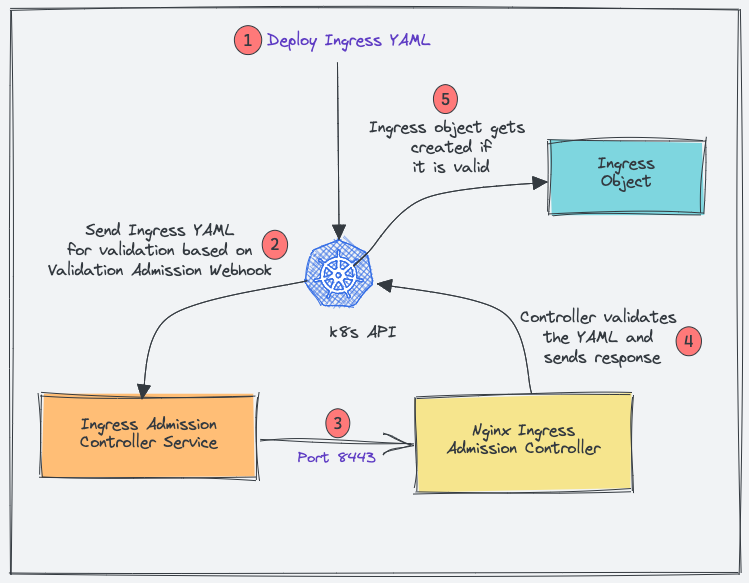
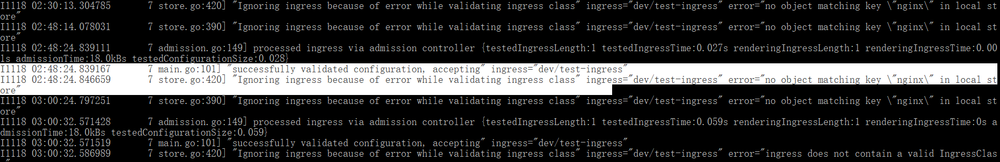
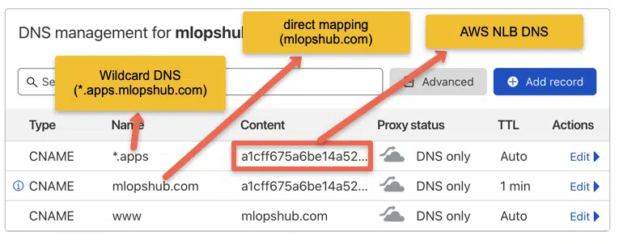
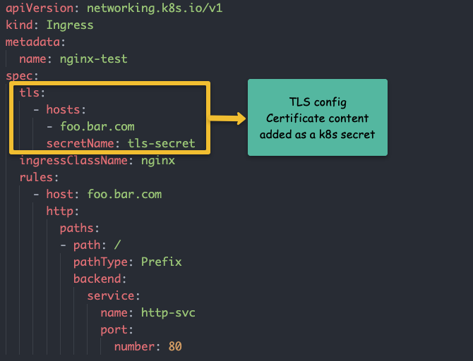

# How to Setup Nginx Ingress Controller On Kubernetes – Detailed Guide


We need to deploy the following objects to have a working Nginx controller.
1. ingress-nginx namespace
2. Service account/Roles/ClusterRoles for Nginx admission controller
3. Validating webhook Configuration
4. Jobs to create/update Webhook CA bundles
5. Service account/Roles/ClusterRoles of Nginx controller deployment
6. Nginx controller configmap
7. Services for nginx controller & admission controller
8. Ingress controller deployment

## Need for Admission Controller & Validating Webhook
Kubernetes Admission Controller is a small piece of code to validate or update Kubernetes objects before creating them. In this case, it’s an admission controller to validate the ingress objects. In this case, the Admission Controller code is part of the Nginx controller which listens on port 8443.

We can deploy ingress objects with the wrong configuration without an admission controller. However, it breaks all the ingress rules associated with the ingress controller.

With the admission controller in place, we can ensure that the ingress object we create has configurations and doesn’t break routing rules.

Here is how admission controllers work for Nginx.



1. When you deploy an ingress YAML, the Validation admission intercepts the request.
2. Kubernetes API then sends the ingress object to the validation admission controller service endpoint based on admission webhook endpoints.
3. Service sends the request to the Nginx deployment on port 8443 for validating the ingress object.
4. The admission controller then sends a response to the k8s API.
5. If it is a valid response, the API will create the ingress object.
Now let’s get started by creating Kubernetes objects for the ingress controller.

## Create a Namespace

`kubectl create ns ingress-nginx`

## Create Admission Controller Roles & Service Account
We need a Role and ClusterRole with required permissions and bind to ingress-nginx-admission service account.

Create a file named admission-service-account.yaml and copy the following contents.
``` yml
---
apiVersion: v1
kind: ServiceAccount
metadata:
  labels:
    app.kubernetes.io/component: admission-webhook
    app.kubernetes.io/instance: ingress-nginx
    app.kubernetes.io/name: ingress-nginx
  name: ingress-nginx-admission
  namespace: ingress-nginx

---
apiVersion: rbac.authorization.k8s.io/v1
kind: Role
metadata:
  annotations:
    app.kubernetes.io/component: admission-webhook
    app.kubernetes.io/instance: ingress-nginx
    app.kubernetes.io/name: ingress-nginx
  name: ingress-nginx-admission
  namespace: ingress-nginx
rules:
- apiGroups:
  - ""
  resources:
  - secrets
  verbs:
  - get
  - create

---
apiVersion: rbac.authorization.k8s.io/v1
kind: RoleBinding
metadata:
  labels:
    app.kubernetes.io/component: admission-webhook
    app.kubernetes.io/instance: ingress-nginx
    app.kubernetes.io/name: ingress-nginx
  name: ingress-nginx-admission
  namespace: ingress-nginx
roleRef:
  apiGroup: rbac.authorization.k8s.io
  kind: Role
  name: ingress-nginx-admission
subjects:
- kind: ServiceAccount
  name: ingress-nginx-admission
  namespace: ingress-nginx


---
apiVersion: rbac.authorization.k8s.io/v1
kind: ClusterRole
metadata:
  labels:
    app.kubernetes.io/component: admission-webhook
    app.kubernetes.io/instance: ingress-nginx
    app.kubernetes.io/name: ingress-nginx
  name: ingress-nginx-admission
rules:
- apiGroups:
  - admissionregistration.k8s.io
  resources:
  - validatingwebhookconfigurations
  verbs:
  - get
  - update

---
apiVersion: rbac.authorization.k8s.io/v1
kind: ClusterRoleBinding
metadata:
  labels:
    app.kubernetes.io/component: admission-webhook
    app.kubernetes.io/instance: ingress-nginx
    app.kubernetes.io/name: ingress-nginx
  name: ingress-nginx-admission
roleRef:
  apiGroup: rbac.authorization.k8s.io
  kind: ClusterRole
  name: ingress-nginx-admission
subjects:
- kind: ServiceAccount
  name: ingress-nginx-admission
  namespace: ingress-nginx
  ```

  Deploy the manifest.

`kubectl apply -f admission-service-account.yaml `

## Create Validating Webhook Configuration
Create a file named validating-webhook.yaml and copy the following contents.

``` yml
---
apiVersion: admissionregistration.k8s.io/v1
kind: ValidatingWebhookConfiguration
metadata:
  labels:
    app.kubernetes.io/component: admission-webhook
    app.kubernetes.io/instance: ingress-nginx
    app.kubernetes.io/name: ingress-nginx
  name: ingress-nginx-admission
webhooks:
- admissionReviewVersions:
  - v1
  clientConfig:
    service:
      name: ingress-nginx-controller-admission
      namespace: ingress-nginx
      path: /networking/v1/ingresses
  failurePolicy: Fail
  matchPolicy: Equivalent
  name: validate.nginx.ingress.kubernetes.io
  rules:
  - apiGroups:
    - networking.k8s.io
    apiVersions:
    - v1
    operations:
    - CREATE
    - UPDATE
    resources:
    - ingresses
  sideEffects: None

```

Create the ValidatingWebhookConfiguration

`kubectl apply -f validating-webhook.yaml`

## Deploy Jobs To Update Webhook Certificates
The ValidatingWebhookConfiguration works only over HTTPS. So it needs a CA bundle.

We use kube-webhook-certgen to generate a CA cert bundle with the first job. The generated CA certs are stored in a secret named ingress-nginx-admission

The second job patches the ValidatingWebhookConfiguration object with the CA bundle.

Create a file named jobs.yaml and copy the following contents.
``` yml
---
apiVersion: batch/v1
kind: Job
metadata:
  labels:
    app.kubernetes.io/component: controller
    app.kubernetes.io/instance: ingress-nginx
    app.kubernetes.io/name: ingress-nginx
  name: ingress-nginx-admission-create
  namespace: ingress-nginx
spec:
  template:
    metadata:
      labels:
        app.kubernetes.io/component: controller
        app.kubernetes.io/instance: ingress-nginx
        app.kubernetes.io/name: ingress-nginx
      name: ingress-nginx-admission-create
    spec:
      containers:
      - args:
        - create
        - --host=ingress-nginx-controller-admission,ingress-nginx-controller-admission.$(POD_NAMESPACE).svc
        - --namespace=$(POD_NAMESPACE)
        - --secret-name=ingress-nginx-admission
        env:
        - name: POD_NAMESPACE
          valueFrom:
            fieldRef:
              fieldPath: metadata.namespace
        image: k8s.gcr.io/ingress-nginx/kube-webhook-certgen:v1.1.1
        imagePullPolicy: IfNotPresent
        name: create
        securityContext:
          allowPrivilegeEscalation: false
      nodeSelector:
        kubernetes.io/os: linux
      restartPolicy: OnFailure
      securityContext:
        runAsNonRoot: true
        runAsUser: 2000
      serviceAccountName: ingress-nginx-admission
---
apiVersion: batch/v1
kind: Job
metadata:
  labels:
    app.kubernetes.io/component: admission-webhook
    app.kubernetes.io/instance: ingress-nginx
    app.kubernetes.io/name: ingress-nginx
  name: ingress-nginx-admission-patch
  namespace: ingress-nginx
spec:
  template:
    metadata:
      labels:
        app.kubernetes.io/component: admission-webhook
        app.kubernetes.io/instance: ingress-nginx
        app.kubernetes.io/name: ingress-nginx
      name: ingress-nginx-admission-patch
    spec:
      containers:
      - args:
        - patch
        - --webhook-name=ingress-nginx-admission
        - --namespace=$(POD_NAMESPACE)
        - --patch-mutating=false
        - --secret-name=ingress-nginx-admission
        - --patch-failure-policy=Fail
        env:
        - name: POD_NAMESPACE
          valueFrom:
            fieldRef:
              fieldPath: metadata.namespace
        image: k8s.gcr.io/ingress-nginx/kube-webhook-certgen:v1.1.1
        imagePullPolicy: IfNotPresent
        name: patch
        securityContext:
          allowPrivilegeEscalation: false
      nodeSelector:
        kubernetes.io/os: linux
      restartPolicy: OnFailure
      securityContext:
        runAsNonRoot: true
        runAsUser: 2000
      serviceAccountName: ingress-nginx-admission
```

` kubectl apply -f .\jobs.yaml`

## Create Ingress Controller Roles & Service Account
Create a file named ingress-service-account.yaml and copy the following contents.

``` yml
---
apiVersion: v1
kind: ServiceAccount
metadata:
  labels:
    app.kubernetes.io/component: admission-webhook
    app.kubernetes.io/instance: ingress-nginx
    app.kubernetes.io/name: ingress-nginx
  name: ingress-nginx
  namespace: ingress-nginx

---
apiVersion: rbac.authorization.k8s.io/v1
kind: Role
metadata:
  labels:
    app.kubernetes.io/component: controller
    app.kubernetes.io/instance: ingress-nginx
    app.kubernetes.io/name: ingress-nginx
  name: ingress-nginx
  namespace: ingress-nginx
rules:
- apiGroups:
  - ""
  resources:
  - namespaces
  verbs:
  - get
- apiGroups:
  - ""
  resources:
  - configmaps
  - pods
  - secrets
  - endpoints
  verbs:
  - get
  - list
  - watch
- apiGroups:
  - ""
  resources:
  - services
  verbs:
  - get
  - list
  - watch
- apiGroups:
  - networking.k8s.io
  resources:
  - ingresses
  verbs:
  - get
  - list
  - watch
- apiGroups:
  - networking.k8s.io
  resources:
  - ingresses/status
  verbs:
  - update
- apiGroups:
  - networking.k8s.io
  resources:
  - ingressclasses
  verbs:
  - get
  - list
  - watch
- apiGroups:
  - ""
  resourceNames:
  - ingress-controller-leader
  resources:
  - configmaps
  verbs:
  - get
  - update
- apiGroups:
  - ""
  resources:
  - configmaps
  verbs:
  - create
- apiGroups:
  - ""
  resources:
  - events
  verbs:
  - create
  - patch

---
apiVersion: rbac.authorization.k8s.io/v1
kind: RoleBinding
metadata:
  labels:
    app.kubernetes.io/component: controller
    app.kubernetes.io/instance: ingress-nginx
    app.kubernetes.io/name: ingress-nginx
  name: ingress-nginx
  namespace: ingress-nginx
roleRef:
  apiGroup: rbac.authorization.k8s.io
  kind: Role
  name: ingress-nginx
subjects:
- kind: ServiceAccount
  name: ingress-nginx
  namespace: ingress-nginx

---
apiVersion: rbac.authorization.k8s.io/v1
kind: ClusterRole
metadata:
  labels:
    app.kubernetes.io/component: controller
    app.kubernetes.io/instance: ingress-nginx
    app.kubernetes.io/name: ingress-nginx
  name: ingress-nginx
rules:
- apiGroups:
  - ""
  resources:
  - configmaps
  - endpoints
  - nodes
  - pods
  - secrets
  - namespaces
  verbs:
  - list
  - watch
- apiGroups:
  - ""
  resources:
  - nodes
  verbs:
  - get
- apiGroups:
  - ""
  resources:
  - services
  verbs:
  - get
  - list
  - watch
- apiGroups:
  - networking.k8s.io
  resources:
  - ingresses
  verbs:
  - get
  - list
  - watch
- apiGroups:
  - ""
  resources:
  - events
  verbs:
  - create
  - patch
- apiGroups:
  - networking.k8s.io
  resources:
  - ingresses/status
  verbs:
  - update
- apiGroups:
  - networking.k8s.io
  resources:
  - ingressclasses
  verbs:
  - get
  - list
  - watch

---
apiVersion: rbac.authorization.k8s.io/v1
kind: ClusterRoleBinding
metadata:
  labels:
    app.kubernetes.io/component: controller
    app.kubernetes.io/instance: ingress-nginx
    app.kubernetes.io/name: ingress-nginx
  name: ingress-nginx
roleRef:
  apiGroup: rbac.authorization.k8s.io
  kind: ClusterRole
  name: ingress-nginx
subjects:
- kind: ServiceAccount
  name: ingress-nginx
  namespace: ingress-nginx
```

Deploy the manifest.

`kubectl apply -f ingress-service-account.yaml`

## Create Configmap
With this configmap, you can customize the Nginx settings. For example, you can set custom headers and most of the Nginx settings. Please refer to the official community documentation for all the supported configurations.

Create a file named configmap.yaml and copy the following contents.
``` yml
---
apiVersion: v1
data:
  allow-snippet-annotations: "true"
kind: ConfigMap
metadata:
  labels:
    app.kubernetes.io/component: controller
    app.kubernetes.io/instance: ingress-nginx
    app.kubernetes.io/name: ingress-nginx
  name: ingress-nginx-controller
  namespace: ingress-nginx
```
Create the configmap.

`kubectl apply -f configmap.yaml`

## Create Ingress Controller & Admission Controller Services
Create a file named services.yaml and copy the following contents.

``` yml
---
apiVersion: v1
kind: Service
metadata:
  labels:
    app.kubernetes.io/component: controller
    app.kubernetes.io/instance: ingress-nginx
    app.kubernetes.io/name: ingress-nginx
  name: ingress-nginx-controller
  namespace: ingress-nginx
spec:
  externalTrafficPolicy: Local
  ipFamilies:
  - IPv4
  ipFamilyPolicy: SingleStack
  ports:
  - appProtocol: http
    name: http
    port: 80
    protocol: TCP
    targetPort: http
  - appProtocol: https
    name: https
    port: 443
    protocol: TCP
    targetPort: https
  selector:
    app.kubernetes.io/component: controller
    app.kubernetes.io/instance: ingress-nginx
    app.kubernetes.io/name: ingress-nginx
  type: LoadBalancer
---
apiVersion: v1
kind: Service
metadata:
  labels:
    app.kubernetes.io/component: controller
    app.kubernetes.io/instance: ingress-nginx
    app.kubernetes.io/name: ingress-nginx
  name: ingress-nginx-controller-admission
  namespace: ingress-nginx
spec:
  ports:
  - appProtocol: https
    name: https-webhook
    port: 443
    targetPort: webhook
  selector:
    app.kubernetes.io/component: controller
    app.kubernetes.io/instance: ingress-nginx
    app.kubernetes.io/name: ingress-nginx
  type: ClusterIP
```
Create the services.

`kubectl apply -f services.yaml`
ingress-nginx-controller creates a Loadbalancer in the respective cloud platform you are deploying.

You can get the load balancer IP/DNS using the following command.

`kubectl --namespace ingress-nginx get services -o wide -w ingress-nginx-controller`

Note: For each cloud provider there are specific annotations you can use to map static IP address and other configs to the Loadbalancer. Check out GCP annotations here and AWS annoatations here.

## Create Ingress Controller Deployment
Create a file named deployment.yaml and copy the following contents.

``` yml
---
apiVersion: apps/v1
kind: Deployment
metadata:
  labels:
    app.kubernetes.io/component: controller
    app.kubernetes.io/instance: ingress-nginx
    app.kubernetes.io/name: ingress-nginx
  name: ingress-nginx-controller
  namespace: ingress-nginx
spec:
  minReadySeconds: 0
  revisionHistoryLimit: 10
  selector:
    matchLabels:
      app.kubernetes.io/component: controller
      app.kubernetes.io/instance: ingress-nginx
      app.kubernetes.io/name: ingress-nginx
  template:
    metadata:
      labels:
        app.kubernetes.io/component: controller
        app.kubernetes.io/instance: ingress-nginx
        app.kubernetes.io/name: ingress-nginx
    spec:
      containers:
      - args:
        - /nginx-ingress-controller
        - --publish-service=$(POD_NAMESPACE)/ingress-nginx-controller
        - --election-id=ingress-controller-leader
        - --controller-class=k8s.io/ingress-nginx
        - --configmap=$(POD_NAMESPACE)/ingress-nginx-controller
        - --validating-webhook=:8443
        - --validating-webhook-certificate=/usr/local/certificates/cert
        - --validating-webhook-key=/usr/local/certificates/key
        env:
        - name: POD_NAME
          valueFrom:
            fieldRef:
              fieldPath: metadata.name
        - name: POD_NAMESPACE
          valueFrom:
            fieldRef:
              fieldPath: metadata.namespace
        - name: LD_PRELOAD
          value: /usr/local/lib/libmimalloc.so
        image: k8s.gcr.io/ingress-nginx/controller:v1.1.1
        imagePullPolicy: IfNotPresent
        lifecycle:
          preStop:
            exec:
              command:
              - /wait-shutdown
        livenessProbe:
          failureThreshold: 5
          httpGet:
            path: /healthz
            port: 10254
            scheme: HTTP
          initialDelaySeconds: 10
          periodSeconds: 10
          successThreshold: 1
          timeoutSeconds: 1
        name: controller
        ports:
        - containerPort: 80
          name: http
          protocol: TCP
        - containerPort: 443
          name: https
          protocol: TCP
        - containerPort: 8443
          name: webhook
          protocol: TCP
        readinessProbe:
          failureThreshold: 3
          httpGet:
            path: /healthz
            port: 10254
            scheme: HTTP
          initialDelaySeconds: 10
          periodSeconds: 10
          successThreshold: 1
          timeoutSeconds: 1
        resources:
          requests:
            cpu: 100m
            memory: 90Mi
        securityContext:
          allowPrivilegeEscalation: true
          capabilities:
            add:
            - NET_BIND_SERVICE
            drop:
            - ALL
          runAsUser: 101
        volumeMounts:
        - mountPath: /usr/local/certificates/
          name: webhook-cert
          readOnly: true
      dnsPolicy: ClusterFirst
      nodeSelector:
        kubernetes.io/os: linux
      serviceAccountName: ingress-nginx
      terminationGracePeriodSeconds: 300
      volumes:
      - name: webhook-cert
        secret:
          secretName: ingress-nginx-admission
```
Create the deployment.

`kubectl apply -f deployment.yaml`
To ensure that deployment is working, check the pod status.

`kubectl get pods -n ingress-nginx`

NOTE: in some cluster, you may got error "error="no object matching key \"nginx\" in local store", need install ingressClass Resource




## Nginx Ingress Controller Helm Deployment

If you are a Helm user, you can deploy the ingress controller using the community helm chart. ValidatingWebhookConfiguration is disabled by default in values.yaml.

Deploy the helm chart. It will create the namespace ingress-nginx if not present.
```
helm upgrade --install ingress-nginx ingress-nginx \
  --repo https://kubernetes.github.io/ingress-nginx \
  --namespace ingress-nginx --create-namespace
```
Verify the helm release.

`helm list -n ingress-nginx`

To clean up the resources, uninstall the release.

`helm uninstall ingress-nginx -n ingress-nginx`

## Map a Domain Name To Ingress Loadbalancer IP

The primary goal of Ingress is to receive external traffic to services running on Kubernetes. Ideally in projects, a DNS would be mapped to the ingress controller Loadbalancer IP.

This can be done via the respective DNS provider with the domain name you own.

Info: For internet-facing apps, it will be public DNS pointing to the public IP of the load balancer. If it’s an internal app, it will be an organization’s private DNS mapped to a private load balancer IP.

### Single DNS Mapping
You can map a single domain directly as an A record to the load balancer IP. Using this you can have only one domain for the ingress controller and multiple path-based traffic routing.

For example,

www.example.com --> Loadbalancer IP
You can also have path-based routing using this model.
Few examples,

http://www.example.com/app1
http://www.example.com/app2
http://www.example.com/app1/api
http://www.example.com/app2/api

## Wildcard DNS Mapping
If you map a wildcard DNS to the load balancer, you can have dynamic DNS endpoints through ingress.

Once you add the wildcard entry in the DNS records, you need to mention the required DNS in the ingress object and the Nginx ingress controller will take care of routing it to the required service endpoint.

For example, check the following two mappings.

*.example.com --> Loadbalancer IP
*.apps.example.com --> Loadbalancer IP 
This way you can have multiple dynamic subdomains through a single ingress controller and each DNS can have its own path-based routing.
Few examples,

#URL one

http://demo1.example.com/api
http://demo1.example.com/api/v1
http://demo1.example.com/api/v2

#app specific urls

http://grafana.apps.example.com
http://prometheus.apps.example.com

#URL two

http://demo2.apps.example.com/api
http://demo2.apps.example.com/api/v1
http://demo2.apps.example.com/api/v2
For demo purposes, I have mapped a wildcard DNS to the LoadBalancer IP. Based on your DNS provider, you can add the DNS record.
The following image shows the DNS records I used for this blog demo. I used EKS so instead of Loadnbalacer IP, I have a DNS of network load balancer endpoint which will be a CNAME. In the case of GKE, you will get an IP and in that case, you need to create an A record.


## Deploy a Demo Application
* Step 1: Create a namespace named dev
`kubectl create namespace dev`
* Step 2: Deploy the app
``` yml
apiVersion: apps/v1
kind: Deployment
metadata:
  name: hello-app
  namespace: dev
spec:
  selector:
    matchLabels:
      app: hello
  replicas: 3
  template:
    metadata:
      labels:
        app: hello
    spec:
      containers:
      - name: hello
        image: "gcr.io/google-samples/hello-app:2.0"
```
* Step3: Create the Service
``` yml
apiVersion: v1
kind: Service
metadata:
  name: hello-service
  namespace: dev
  labels:
    app: hello
spec:
  type: ClusterIP
  selector:
    app: hello
  ports:
  - port: 80
    targetPort: 8080
    protocol: TCP
```

## Create Ingress Object for Application

Now let’s create an ingress object to access our hello app using a DNS. An ingress object is nothing but a setup of routing rules.

If you are wondering how the ingress object is connected to the Nginx controller, the ingress controller pod connects to the Ingress API to check for rules and it updates its nginx.conf accordingly.

Since I have wildcard DNS mapped (*.apps.mlopshub.com) with the DNS provider, I will use demo.apps.mlopshub.com to point to the hello app service.

Step 1: Create a file named ingress.yaml

Step 2: Copy the following contents and save the file.

Replace demo.apps.mlopshub.com with your domain name. Also, we are creating this ingress object in the dev namespace as the hello app is running in the dev namespace.

``` yml
apiVersion: networking.k8s.io/v1
kind: Ingress
metadata:
  name: test-ingress
  namespace: dev
spec:
  ingressClassName: nginx
  rules:
  - host: "demo.apps.mlopshub.com"
    http:
      paths:
        - pathType: Prefix
          path: "/"
          backend:
            service:
              name: hello-service
              port:
                number: 80
```

## TLS With Nginx Ingress
ou can configure TLS certificates with each ingress object. The TLS gets terminated at the ingress controller level.

The following image shows the ingress TLS config. The TLS certificate needs to be added as a secret object.


