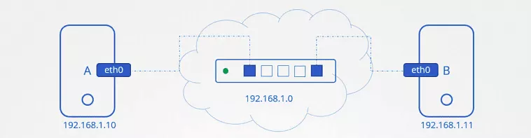
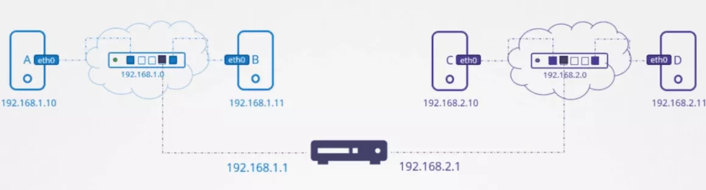

# Basic Networking Concepts

In this tutorial, we are going to discuss about basis networking concepts like switching, routing and gateways etc.

## Switching and Routing
We have two computers A and B, laptops, desktops, VMs on the cloud, wherever. How does system A reach B?

### Switching
We connect them to a switch, and the switch creates a network containing the two systems. To connect them to a switch we need an interface on each host. Physical or virtual depending on the host to see the interfaces for the host. We use the IP link command.

The switch can only enable communication within and network which means it can receive packets from a host on the network and deliver it to other systems within the same network.

### Router
Say we have another network containing systems C & D at address 192.168.2.0. The Systems have IP address 192.168.2.10 and 2.11 respectively. How does a system in one network reach a system in the other?
How does System B with the IP 192.168.1.11 reach system C with the IP 2.10 on the other network. That’s where a Router comes in.
A Router helps connect two networks together. It is an intelligent device, so think of it as another server with many network ports.
Since it connects to the two separate networks, it gets two IPs assigned. One on each network. In the first network we assign it an IP address 192.168.1.1 and in the second we assign it an IP 192.168.2.1.

