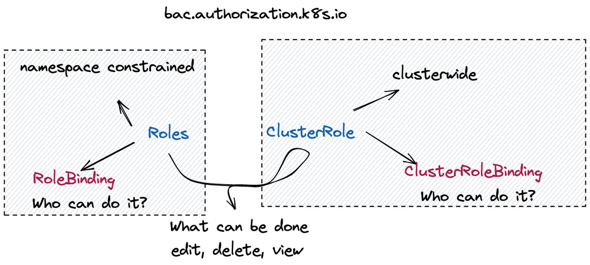

# Kubernetes RBAC Authorization

When you are the only one using a Kubernetes cluster, you likely haven’t had the need yet to look into and implement a systematic approach to authorising users. However, once your team grows and you have multiple people accessing the same cluster, it is time to look into RBAC.

RBAC stands for Role-Based Access Control; it allows us to define user privileges i.e. who is able to access which type of Kubernetes resources. 

## How does it work?
Kubernetes objects are defined through different API specifications. RBAC is part of the rbac.authorization.k8s.io API group — this group references four different types of Kubernetes objects.

(When we define Kubernetes manifests, we define at the beginning of the YAML file what kind of object the manifest is going to be. For instance, Deployment or Service are each Kubernetes objects that are defined through an API.)

In the case of the RBAC API, we can reference four different types of Kubernetes objects, namely: Role, ClusterRole, RoleBinding, and ClusterRoleBinding.
Role and ClusterRole define WHAT can be done vs RoleBinding and ClusterRoleBinding define WHO can do it.

The difference between Role and ClusterRole are:
ClusterRole would be applied to the entire cluster while Role can be constrained to specific namespaces. This makes it possible to allow users to only access specific namespaces and be granted different permissions within the namespace. On the other hand, ClusterRole allows you to constrain access to resources that are cluster-wide, such as nodes. Additionally, ClusterRole is also used for Non-resource REST Endpoints such as /healthz.



Here is an example of a “Role” resource:
```
apiVersion: rbac.authorization.k8s.io/v1
kind: Role
metadata:
  namespace: default
  name: pod-reader
rules:
- apiGroups: [""] # "" indicates the core API group
  resources: ["pods"]
  verbs: ["get", "watch", "list"]
```
## Let’s get practical

RBAC is part of Kubernetes since release 1.6, in most Kubernetes clusters, it is enabled by default. To check whether it is enabled in your cluster, “look for an RBAC configuration file in /etc/kubernetes/manifests on your master node(s) or the Kubernetes API server pod, and make sure it contains the flag”:

`--authorization-mode=Node,RBAC`

### First steps

First, you will have to create a Role or a ClusterRole and then connect it to a RoleBinding to the Role or the ClusterRoleBinding to the ClusterRole.

### Creating a new user and permissions through User-Role-Binding
In this example, we are going to create a new user an giving that user access to just a specific namespace.

Kubernetes does not have a concept of users, instead it relies on certificates and would only trust certificates signed by its own CA.

To get the CA certificates for our cluster, easiest way is to access the master node.
Because we run on kind, our master node is a docker container.
The CA certificates exists in the `/etc/kubernetes/pki` folder by default.
If you are using minikube you may find it under ~/.minikube/.

Access the master node:

`docker exec -it rbac-control-plane bash`

```
ls -l /etc/kubernetes/pki
total 60
-rw-r--r-- 1 root root 1135 Sep 10 01:38 apiserver-etcd-client.crt
-rw------- 1 root root 1675 Sep 10 01:38 apiserver-etcd-client.key
-rw-r--r-- 1 root root 1143 Sep 10 01:38 apiserver-kubelet-client.crt
-rw------- 1 root root 1679 Sep 10 01:38 apiserver-kubelet-client.key
-rw-r--r-- 1 root root 1306 Sep 10 01:38 apiserver.crt
-rw------- 1 root root 1675 Sep 10 01:38 apiserver.key
-rw-r--r-- 1 root root 1066 Sep 10 01:38 ca.crt
-rw------- 1 root root 1675 Sep 10 01:38 ca.key
drwxr-xr-x 2 root root 4096 Sep 10 01:38 etcd
-rw-r--r-- 1 root root 1078 Sep 10 01:38 front-proxy-ca.crt
-rw------- 1 root root 1679 Sep 10 01:38 front-proxy-ca.key
-rw-r--r-- 1 root root 1103 Sep 10 01:38 front-proxy-client.crt
-rw------- 1 root root 1675 Sep 10 01:38 front-proxy-client.key
-rw------- 1 root root 1679 Sep 10 01:38 sa.key
-rw------- 1 root root  451 Sep 10 01:38 sa.pub

## exit the container
## Copy the certs out of our master node:

cd kubernetes/rbac
docker cp rbac-control-plane:/etc/kubernetes/pki/ca.crt ca.crt
docker cp rbac-control-plane:/etc/kubernetes/pki/ca.key ca.key
```

As mentioned before, Kubernetes has no concept of users, it trusts certificates that is signed by its CA.
This allows a lot of flexibility as Kubernetes lets you bring your own auth mechanisms, such as OpenID Connect or OAuth.

This allows managed Kubernetes offerings to use their cloud logins to authenticate.

So on Azure, I can use my Microsoft account, GKE my Google account and AWS EKS my Amazon account.

You will need to consult your cloud provider to setup authentication.
Example [Azure AKS](https://docs.microsoft.com/en-us/azure/aks/azure-ad-integration-cli)

#### Create User Certificates
First thing we need to do is create a certificate signed by our Kubernetes CA.
We have the CA, let's make a certificate. - Let's create a certificate for Bob Smith:

```
#start with a private key
openssl genrsa -out bob.key 2048

##Now we have a key, we need a certificate signing request (CSR). 
openssl req -new -key bob.key -out bob.csr -subj "/CN=Bob Smith/O=Shopping"

#Use the CA to generate our certificate by signing our CSR.
openssl x509 -req -in bob.csr -CA ca.crt -CAkey ca.key -CAcreateserial -out bob.crt -days 100

```

#### Building a kube config
1. install kubectl and nano

```
apt-get install curl nano
curl -LO https://storage.googleapis.com/kubernetes-release/release/`curl -s https://storage.googleapis.com/kubernetes-release/release/stable.txt`/bin/linux/amd64/kubectl
chmod +x ./kubectl
mv ./kubectl /usr/local/bin/kubectl
```

2. set KUBECONFIG environment variable, - kubectl will read config from this 
`export KUBECONFIG=~/.kube/config`

3. Create a cluster entry which points to the cluster and contains the details of the CA certificate:

```
kubectl config set-cluster kind-rbac --server=https://127.0.0.1:3739 \
--certificate-authority=ca.crt \
--embed-certs=true
```

4. set user bob

`kubectl config set-credentials bob --client-certificate=bob.crt --client-key=bob.key --embed-certs=true`

5. set context and use this context as current context

`kubectl config set-context rbac --cluster=kind-rbac --namespace=shopping --user=bob`

`kubectl config use-context rbac`

6. try to access the pod 
kubectl get pods Error from server (Forbidden): pods is forbidden: User "Bob Smith" cannot list resource "pods" in API group "" in the namespace "shopping"

#### Give Bob Smith Access

```
kubectl create ns shopping

kubectl -n shopping apply -f .\role.yaml
kubectl -n shopping apply -f .\rolebinding.yaml
```

## Kubernetes Service Accounts
So we've covered users, but what about applications or services running in our cluster ?
Most business apps will not need to connect to the kubernetes API unless you are building something that integrates with your cluster, like a CI/CD tool, an autoscaler or a custom webhook.

Generally applications will use a service account to connect.
You can read more about Kubernetes [Service Accounts](https://kubernetes.io/docs/tasks/configure-pod-container/configure-service-account/).

Let's deploy a service account
`kubectl -n shopping apply -f serviceaccount.yaml`

Now we can deploy a pod that uses the service account
`kubectl -n shopping apply -f pod.yaml`

Now we can test the access from within that pod by trying to list pods:

``` bash
kubectl -n shopping exec -it shopping-api -- bash

# Point to the internal API server hostname
APISERVER=https://kubernetes.default.svc

# Path to ServiceAccount token
SERVICEACCOUNT=/var/run/secrets/kubernetes.io/serviceaccount

# Read this Pod's namespace
NAMESPACE=$(cat ${SERVICEACCOUNT}/namespace)

# Read the ServiceAccount bearer token
TOKEN=$(cat ${SERVICEACCOUNT}/token)

# Reference the internal certificate authority (CA)
CACERT=${SERVICEACCOUNT}/ca.crt

# List pods through the API
curl --cacert ${CACERT} --header "Authorization: Bearer $TOKEN" -s ${APISERVER}/api/v1/namespaces/shopping/pods/ 

# we should see an error not having access
```

Now we can allow this pod to list pods in the shopping namespace
```
kubectl -n shopping apply -f serviceaccount-role.yaml
kubectl -n shopping apply -f serviceaccount-rolebinding.yaml
```
If we try run curl command again we can see now we are able to get a json response with pod information

## Reference

[https://github.com/marcel-dempers/docker-development-youtube-series/tree/master/kubernetes/rbac](https://github.com/marcel-dempers/docker-development-youtube-series/tree/master/kubernetes/rbac)